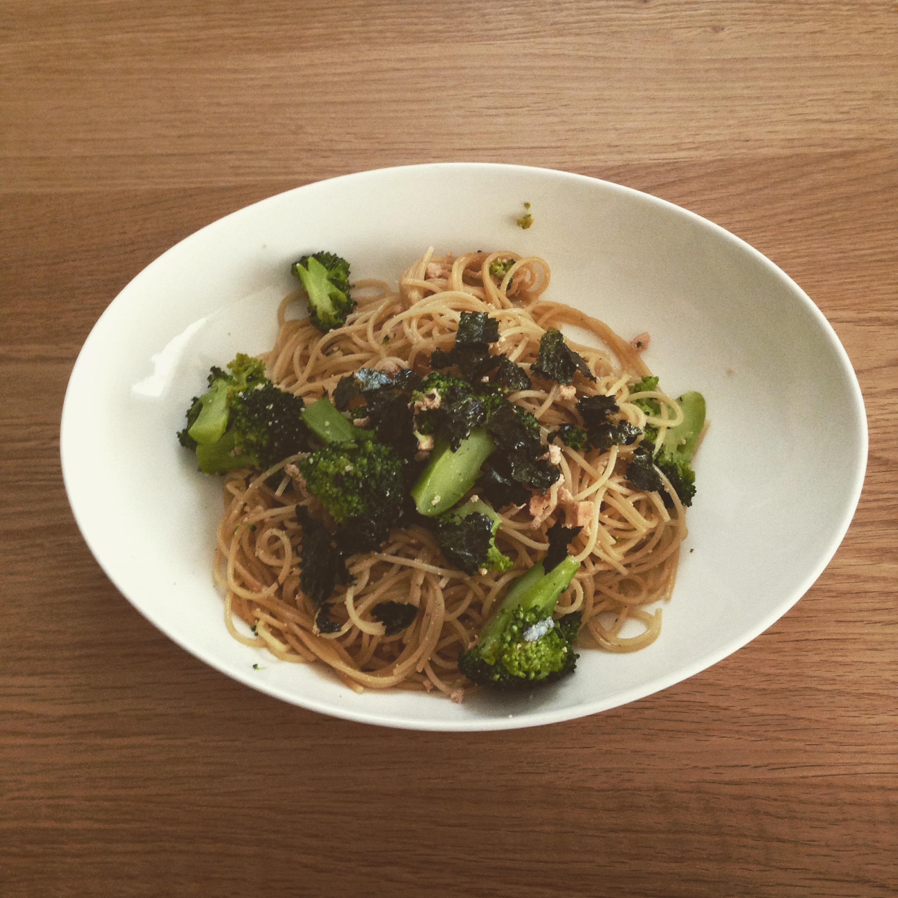

# たらことブロッコリのパスタ

## 材料

| 材料 | 量 |
|---------------------|----------------------------|
| パスタ | |
| たらこ | |
| ブロッコリ | |
| めんつゆ | |
| 醤油 | |
| 塩 | |
| オリーブオイル | |
| こしょう | |
| のり | |

## 手順

1. ブロッコリを茹でる
2. 大きめのなべに水を入れて沸かす
3. 沸騰したら塩を小さじ１入れる
4. パスタをなべに入れる
5. ブロッコリを適当な大きさに切る
6. パスタが茹で上がったら、フライパンに移す
7. オリーブオイルを入れる
8. 火をつけて、ブロッコリとたらこを入れる
9. めんつゆ（大さじ２と２分の１）と醤油（こさじ２分の１）と塩（３つまみぐらい）とこしょう（少々）を入れる
10. よくまぜる
11. うつわに盛り付けて、のりをかける
